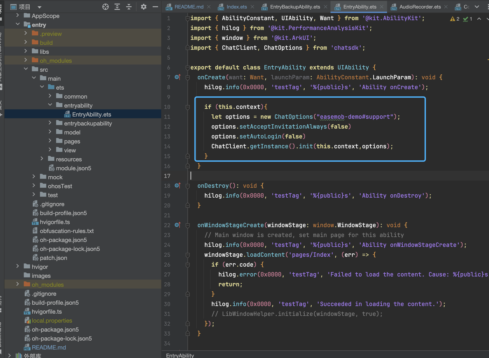
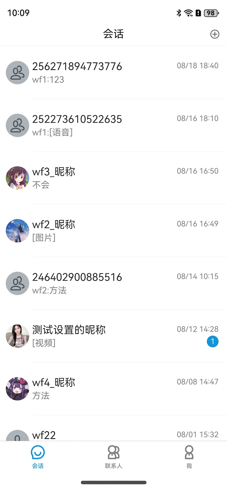
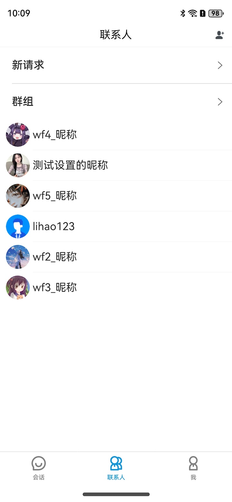
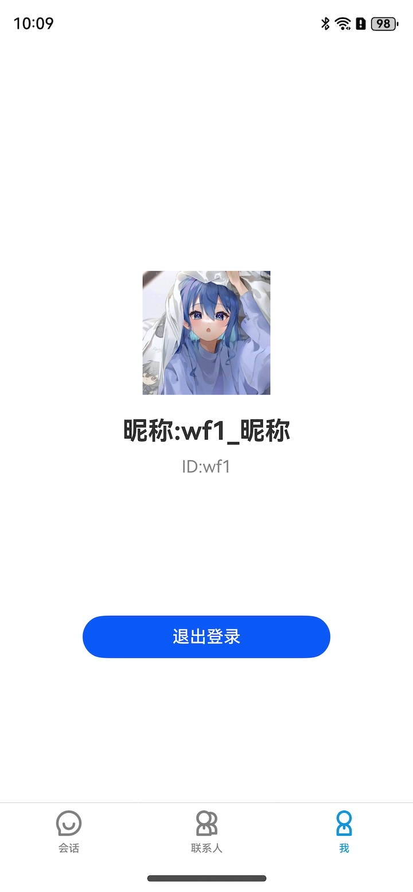
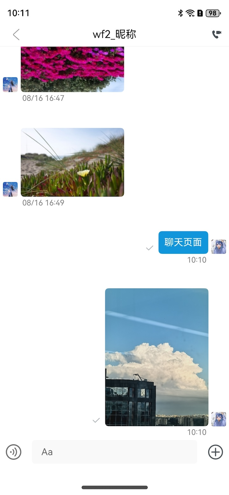

## 基于环信鸿蒙sdk实现一个聊天App
项目地址：https://github.com/easemob/easemob-support/blob/dev/Harmony/Harmony_demo/README.md
## 效果演示


## 项目主要结构
```
└─entry 
  ├─ libs // 本地包路径
  │  └─ chatsdk-1.2.1.har // 环信sdk
  └─ src
     └─ main
        └─ ets
           ├─ connon //公共组件
           │  ├─ AudioRecorder // 录音类（用于发送语音消息）
           │  ├─ CommTitleBar // 导航条封装组件
           │  ├─ FriendRequest // 首选项存取（用于保存好友请求的数据）
           │  ├─ FsUtil // 视频生成缩略图类（用于发送视频消息需要传缩略图使用）
           │  ├─ KVStoreManager // kv数据库类（用户保存用户信息，注意是用户头像和昵称）
           │  ├─ PlayAudio // 播放音频文件（用于播放语音消息）
           │  └─ Utils // 工具类
           ├─ model //model
           │  ├─ ConvListData //会话列表model
           │  └─ MessageListData //消息列表model
           ├─ page //页面
           │  ├─ ChatPage //聊天页面 
           │  ├─ ContactPage //联系人页面
           │  ├─ ConversationPage //会话页面
           │  ├─ FriendRequestPage //好友请求页面
           │  ├─ GroupPage //群组页面
           │  ├─ Index //登录页面页面
           │  ├─ MePage //个人中心页面
           │  └─ VideoPage //视频播放页面
           └─ view // view 
```

## 运行示例项
1.在入口文件进行初始化，填写自己的appkey

2.登录页面

3.会话页面

4.联系人页面

5.个人页面

6.聊天页面


## 示例说明
- 发送语音消息时，需要使用真机，模拟器测试下来录音效果有问题
- 发送视频消息时，需要使用真机，模拟器测试根据视频文件获取第一帧图片会报错
- 联系人页面，先从本地获取数据，如果本地没有数据，就从服务器获取
